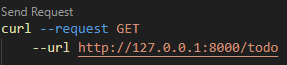

# 1. Routing

#### 1.1 FastAPI의 라우팅
- 단일라우팅만 가능

##### - main.py
```python
from fastapi import FastAPI
app = FastAPI()

@app.get("/")
async def hello() -> dict:
    return {"message": "Hello"}    
```
<br/>
<br/>

#### 1.2 APIRouter
- 단일라우팅, 다중라우팅 모두 사용 가능

>##### 💡 다중라우팅이란? 
>관련된 엔드포인트를 그룹화하고 코드를 모듈화 하는것. 


<br/>


##### 1.2.1 다중라우팅 사용의 장단점

 | 장점                                                     | 단점                                                                           |
 | -------------------------------------------------------- | ------------------------------------------------------------------------------ |
 | 모듈화를 통한 코드구성으로 가독성,확장성,유지보수에 유리 | 작은 규모의 애플리케이션의 경우 불필요한 추상화로 코드 복잡성만 증가할 수 있음 |

<br/>
<br/>

##### 1.2.2 다중라우팅 사용 예시

##### todo.py
```python
from fastapi import APIRouter
todo_router = APIRouter()

@todo_router.post("/todo")
async def add_todo(todo: dict) -> dict:
    todo_list.append(todo)
    return {
        "message": "Todo added successfully"
    }

@todo_router.get("/todo")
async def get_todos() -> dict:
    return {
        "todos": todo_list
    }
```

##### main.py
```python
from fastapi import FastAPI
from .todo import todo_router

app = FastAPI()

@app.get("/")
async def hello() -> dict : 
    return {
        "message": "Hello"
    }

app.include_router(todo_router)
```
<br/>
<br/>

##### 1.2.3 실행 결과
##### POST전송 및 결과

|  |  |
| ------------------------------- | ------------------------------- |


##### GET전송 및 결과
|  |  |
| ------------------------------- | ------------------------------- |