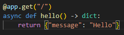
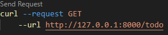
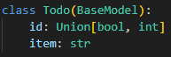
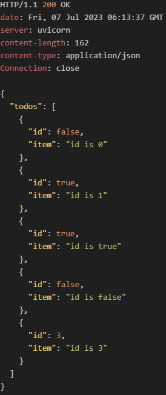
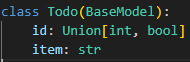
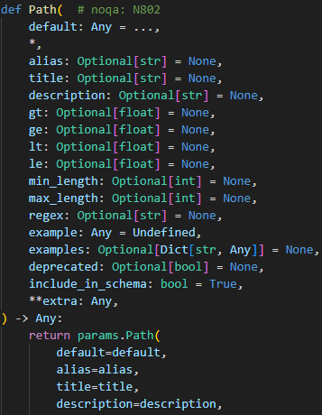
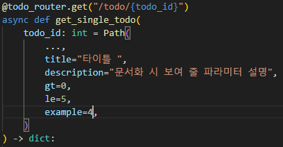
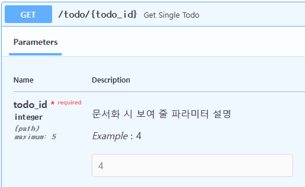

# 2023-07-06 질문리스트
#### ([Part1.Routing] - [Chapter1. Routing] )
#### Q1. 라우팅을 사용할 때 json으로 변환하는 코드가 없는데도 json타입으로 응답이 가능한 이유는?  

<br/>

라우팅이 구현된 내부 코드를 확인해보면 알 수 있습니다.  
아래의 hello() 라우팅함수를 예로 들어보겠습니다. 
hello() 라우팅 함수는 해당경로로 GET요청을 하면 딕셔너리 타입의 값을 반환하는 기능을 하는 함수입니다.  

결과를 보면 코드내에 리턴값을 Json으로 변환하는 코드가 따로 없음에도 Json으로 응답하고 있습니다. 이는 내부적으로 Json으로 변환하는 기능 
이 있다고 추측해볼 수 있으며 실제로 get() 함수의 구현코드를 확인해보면 알 수 있습니다.

<br/>

###### 질문에 해당하는 예시
| 정의                           | 요청                            | 결과                            |
| ------------------------------ | ------------------------------- | ------------------------------- |
|  |  |  |

<br/>
    
위 예시에서 정의된 get()함수의 코드 중 일부는 아래와 같습니다.
  
 

<br/>

코드를 보면 response_class라는 매개변수가 있습니다. response_class는 기본값으로 JSonResponse가 할당되어 있습니다.
 
get뿐만 아니라 put,delete,post,patch 등 라우팅에서 사용할 수 있는 대부분의 기능에서 response_class를 사용하고 있고 기본값으로 역시 JSonResponse가 할당되어 있는걸 확인할 수 있습니다.(이는 APIRouter도 동일합니다.)
 
JSonResponse는 Starlette의 Response를 상속받아 구현한 서브클래스로 이름에서 알수 있듯 응답을 JSon형태로 변환해주는 역할을 합니다.

<br/>

###### JSonResponse


결론  
라우팅 요청에 사용되는 대부분의 기능엔 response_class라는 파라미터가 존재하고 이 파라미터에는 기본값으로 JSONResponse 타입이 지정되어 있다.
결국 이 기본값에 의해 JSON 변환코드를 따로 구현하지 않아도 JSON타입으로 변환하여 응답하게 된다.

<br/> 
<br/>
<br/>

#### [Part1.Routing] - [Chapter2. pydantic 모델을 사용한 요청바디 검증]  
#### Q2. 요청 바디 검증시에 검증 모델에 정의되지 않은 값을 포함하여 요청 했을 시 어떤 결과가 나타나는지?

<br/>

pydantic모델을 사용한 요청바디 검증시에 검증 모델에 없는 값을 포함한 요청에 대해 테스트가 진행되지 않았기에 테스트 해본다.

###### 검증 모델에 없는 값을 포함한 POST 요청 
| 요청                           | 결과                            |
| ------------------------------ | ------------------------------- |
|  |  |

<br/>

###### 요청에 의해 생성된 결과 조회
| 요청                                                                                                                                        | 결과                            |
| ------------------------------------------------------------------------------------------------------------------------------------------- | ------------------------------- |
| &nbsp;&nbsp;&nbsp;&nbsp;&nbsp;&nbsp;&nbsp;&nbsp;&nbsp;&nbsp;&nbsp;&nbsp;&nbsp;&nbsp;&nbsp;&nbsp;&nbsp;&nbsp; |  |

<br/>

검증모델에 없는 값을 포함한 요청이지만 정상적 처리가 된 것을 볼 수 있다.  
Pydantic은 기본적으로 '검증 모델에 정의된 필드만을 대상'으로 검증을 수행한다.
NonExistKey는 검증 모델에 정의된 필드가 아니기에 id, item에 대해서만 검증을 수행하고
id, item의 검증 결과 이상이 없다면 유효성 검사는 통과 된다.  


💡 만약 검증모델에 정의되지 않은 추가필드를 포함한 요청을 허용하지 않도록 하려면? 
- Config에 extra파라미터를 설정해주면 된다. 기존 Todo모델을 추가필드를 허용하지 않도록 변경해보자.

```python
class Todo(BaseModel):
    id: int
    item: str
    
    class Config:        
        extra = "forbid" 
```

<br/>

###### 추가필드허용불가로 수정한 후 테스트
| 요청                            | 결과                            |
| ------------------------------- | ------------------------------- |
|  |  |


<br/>
<br/>
<br/>

#### Q3. 요청 바디 검증 모델 정의시에 타입을 여러 개 지정해 줄 수 있는지?  

<br/>

제한적으로 가능합니다.
검증 모델에서 여러개의 타입에 대한 검증을 수행하려면 Union을 사용해 주면 됩니다.
하지만 예상과 다른 결과를 얻을 수 있는데 우선 아래와 같이 id값을 int, bool 두가지 타입으로 지정한 후 각각 테스트 해보겠습니다.

<br/>

```python
from pydantic import BaseModel
from typing import Union 

# 첫번째 테스트에 사용할 검증모델
class Todo(BaseModel):
    id: Union[bool, int] 
    item: str

# 두번째 테스트에 사용할 검증모델
class Todo(BaseModel):
    id: Union[int, bool] 
    item: str
```

<br/>

###### Union을 사용해 두 가지 이상의 타입을 허용하도록 변경한 후 테스트

| 요청                            | 결과                            |
| ------------------------------- | ------------------------------- |
|  |  |
|  |  |

<br/>

이런 결과가 나온 이유는 다음과 같습니다
Pydantic은 타입 검증에 앞서 형변환을 먼저 수행합니다.
Union에서 우선 정의된 타입으로 형변환이 가능한 값이 들어오면 형변환을 한 후에 검증합니다.
만약 형변환이 불가능한 값이라면 나중에 정의된 타입에 대하여 똑같이 형변환과 검증을 수행합니다.

사용자의 의도가 모든 숫자는 int형으로 true,false값은 bool형으로 전달받길 원한것이었다면
Union만으로 원하는 결과를 얻을 수 없으니 그에 맞는 적절한 처리를 해 주어야만 합니다.

결론
Pydantic에서 두 가지 이상의 타입에 대해 검증하는건 Union을 사용해서 가능하다.
단, Pydantic의 pasing기능에 대한 이해가 우선시 되어야하며 원하는 결과를 얻기 위해 추가처리가 필요할 수 있다.

<br/>
<br/>
<br/>

#### [Part1.Routing][Chapter3. 경로 매개변수와 쿼리 매개변수]  
#### Q5. 경로 매개변수에 Path() 사용 시에 ...의 의미는?

<br/>

'...'은 FastAPI에서 경로 매개변수의 기본값을 의미하며 해당 매개변수가 필수 매개변수라는걸 나타냅니다. 아래는 사용 예시입니다.

<br/>

```python
@todo_router.get("/todo/{todo_id}")
async def get_single_todo(
    todo_id: int = Path(
        ...,
        title="Title of Path Parameter",
        description="Description of Path Parameter",
        gt=0,
        le=5,
    )
```

Path()에서 ''...'은 Path클래스의 default값입니다.
만약 인수로 '...'을 생략한다 하더라도 기본값으로 '...'값이 할당됩니다.

또한 Path()엔 ...이외의 다른 어떠한 값도 할당할 수 없습니다.
이유는 Path()클래스 자체에서 해당값에 ... 이외의 값을 허용하지 않도록 막아 놓았기 때문입니다. 아래는 Path클래스의 코드 중 일부입니다.



assert default is ..., "Path..."

위 코드에 의해 Path()를 사용 시 default에는 '...'이외의 어떠한 값도 허용되지 않도록 되어 있습니다.

<br/>
<br/>
<br/>

#### Q6. Path()에서 사용할 수 있는 파라미터들은 추가로 어떤 것들이 있는지?

<br/>

아래는 Path()의 코드 중 일부입니다.


<br/>

위와 같이 Path()에서 파라미터로 사용하는 값들엔
title, description, example과 같은 문서화도구를 위한 값과  
gt,ge,lt,le,min_length,max_length와 같은 유효성 검사 관련 파라미터 등이 있습니다.

아래는 Path()에서 사용가능한 파라미터들 중 몇가지 파라미터를 사용한 예시입니다.

|  |  |
| ------------------------------------- | ------------------------------------- |

<br/>
<br/>
<br/>

#### [Part1.Routing][Chapter4. 요청바디]
#### Q7. BaseModel을 상속받아 만든 요청 바디 검증시에 문서화에서 확인 가능한 추가 정보들을 넣어줄 수 있는지?

<br/>

#### Q8. FastAPI의 문서화 (/docs, /redoc)를 비활성화 시킬 수 있는지

<br/>

#### [Part2.응답모델과 오류 처리][Chapter1. 응답]
#### Q9. FastAPI의 응답은 보통 JSON 또는 XML형식이지만 문서형식으로 전달되기도 한다고 했는데 문서 형식이란게 어떤 걸 말하는건지? (MIME을 말하는건지?)

<br/>

#### Q10. 응답모델을 작성 후 성공한 예시만 있는지 응답모델 검증에 실패 했을때는 어떻게 되는지?