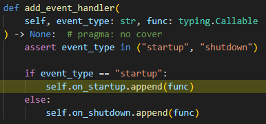

# 2023-07-11 세미나 Q/A LIST (Part3-4)
#### [Part3.구조화] - [Chapter1. FastAPI 애플리케이션 구조화]
#### Q1. pip install fastapi uvicorn "pydantic[email]"  과 같은 형태로 install시 []의 의미

 
 

#### Q2. APIRouter 인스턴스를 생성할 때 APIRouter(tags=["Events"]) 와 같은 형태로 생성하는데 tags에 대해 추가설명

 
 

#### Q3. API로 파일을 주고 받는 걸 구현하려면?

 
 

#### [Part4.데이터베이스 연결] - [Chapter1. SQLModel]
#### Q4. SQLModel을 사용하여 테이블모델을 정의할 때 table=True로 정의하는데 table=False로 정의한다면?

 
 

#### Q5. Event테이블에서 id값이 자동증가값으로 정의되는데 자동증가값이 되기 위한 조건? 

자료형+primary_key=True로 예상하는데 확인

 
 

#### Q6. Field(sa_column=Column(JSON)) 코드에 대한 추가설명

 
 

#### Q7. 세션을 맺을 때 yield를 사용했는데 그 이유와 세션에 대해 추가 보충 설명 

 
 

#### Q8. main.py에서 @app.on_event("startapp") 형태로 이벤트를 등록하는데 해당부분에 대한 추가 설명

 
 

#### [Part4.데이터베이스 연결] - [Chapter3. 이벤트 라우트 변경]
#### Q9. 이벤트 생성, 변경 등에서 session.refresh()를 해주는데 그 이유와 session.refresh()에 대한 추가 설명

