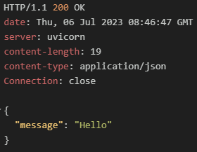
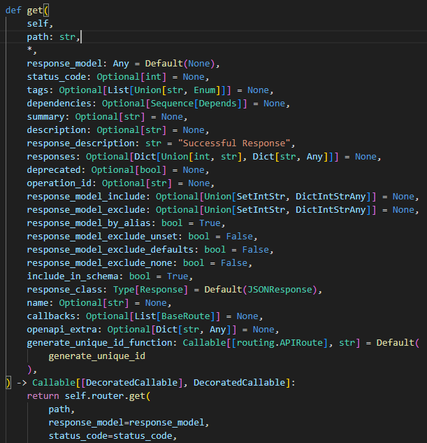
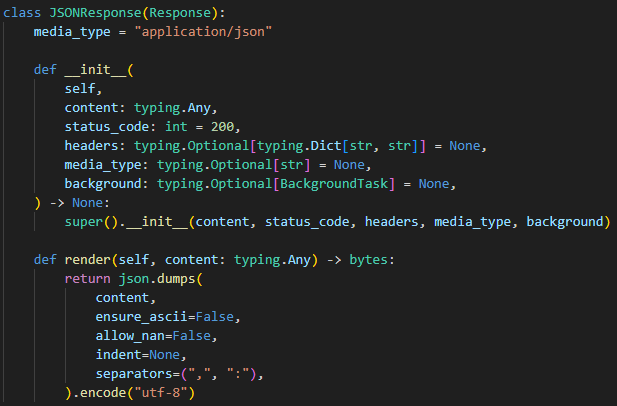

# 2023-07-06 질문리스트
[Part1.Routing][Chapter1. Routing]  
    1. 라우팅을 사용할 때 json으로 변환하는 코드가 없는데도 RESTAPI 통신이 가능한 이유
    
    - FastAPI에서 제공하는 라우팅 어노테이션이 구현되어 있는 코드를 확인해보면 알 수 있습니다. 아래의 get() 라우팅을 예로 들어보겠습니다.

###### 질문에 해당하는 예시
| 정의                   | 요청                     | 결과                     |
| ---------------------- | ------------------------ | ------------------------ |
|  |  |  |

    
 위 예시에서 정의된 get()함수의 코드 중 일부는 아래와 같습니다.
 

 코드에 보면 response_class라는 매개변수가 있습니다. response_class는 기본값으로 JSonResponse를 사용하고 있다는걸 알 수 있습니다. 
 
 get뿐만 아니라 put,delete,post,patch 등 라우팅에서 사용할 수 있는 대부분의 기능에서 response_class를 사용하고 있고 기본값으로 역시 JSonResponse를 사용하고 있는걸 확인할 수 있었습니다.

 JSonResponse는 Starlette의 Response를 상속받아 구현된 클래스로 이름에서 알수 있듯 JSon형태로 직렬화 해주는 역할을 합니다.

###### JSonResponse

    - 결론
    라우팅 요청에 사용되는 대부분의 기능엔 response_class라는 파라미터가 존재하고
    이 파라미터는 기본값으로 JSon으로 직렬화하는 역할을 한다.
    따라서 response_class 파라미터의 값을 일부러 다른 타입으로 지정하여 사용하지 않았다면 기본값으로 설정된 JSonResponse형식으로 데이터를 처리하게 된다.
 

[Part1.Routing][Chapter2. pydantic 모델을 사용한 요청바디 검증]  
 1. 요청 바디 검증시에 스키마에 정의되지 않은 값을 포함하여 요청 했을 시 어떤 결과가 나타나는지?

 

 2. 요청 바디 스키마 정의시에 타입을 여러 개 지정해 줄 수 있는지?  
     - 예) id: int or str

 

[Part1.Routing][Chapter3. 경로 매개변수와 쿼리 매개변수]  
 1. 경로 매개변수에 Path() 사용 시에 ...의 의미와 파이썬 자체에서 ...의 의미

 

 2. Path()에서 사용할 수 있는 파라미터들은 추가로 어떤 것들이 있는지

 

[Part1.Routing][Chapter4. 요청바디]
 1. BaseModel을 상속받아 만든 요청 바디 검증시에 문서화에서 확인 가능한 추가 정보들을 넣어줄 수 있는지.

 

2. FastAPI의 문서화 (/docs, /redoc)를 비활성화 시킬 수 있는지

 

[Part2.응답모델과 오류 처리][Chapter1. 응답]
1. FastAPI의 응답은 보통 JSON 또는 XML형식이지만 문서형식으로 전달되기도 한다고 했는데
   문서 형식이란게 어떤 걸 말하는건지? (MIME을 말하는건지?)

 

2. 응답모델을 작성 후 성공한 예시만 있는지 응답모델 검증에 실패 했을때는 어떻게 되는지?

