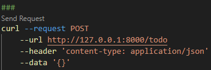
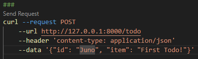
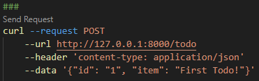
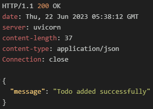
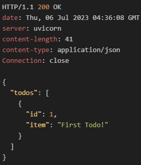
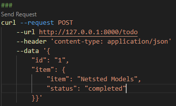

# 2. pydantic 모델을 사용한 요청 바디 검증
#### 2.1 pydantic이란?
- 타입 어노테이션을 사용해 데이터를 검증하는 파이썬 라이브러리
- 정의된 데이터만 전송되도록 요청바디를 검증할 수 있다.
- 요청 데이터가 적절한지 확인하고 악의적인 공격의 위험을 줄일수 있다.
    
<br/>
<br/>

#### 2.2 pydantic을 통한 검증
##### 2.2.1 Todo 애플리케이션에 pydantic을 통한 검증 적용
- 검증 테스트에 사용할 Todo 스키마작성. BaseModel을 상속받은클래스로 작성
- 기존 todo.py파일의 add_todo 함수에 타입 어노테이션 변경
<br/>

##### schemas.py
```python
from pydantic import BaseModel

class Todo(BaseModel):
    id: int
    item: str
```

##### todo.py
```python
from .schema import Todo

@todo_router.post("/todo")
# async def add_todo(todo: Todo) -> dict:
    todo_list.append(todo)
    return {"message": "Todo added successfully"}
```

<br/>
<br/>

##### 2.2.2 실행 결과

- case1. 필요한 키값이 없는경우  
  : request body에 id, item이 존재하지 않는다는 오류메시지 반환 (value_error)

|  |  |
| ------------------------------- | ------------------------------- |

<br/>
<br/>

- case2. 정의된 스키마와 다른유형의 값을 요청하는 경우
  : 올바른 타입의 값이 아니라는 오류메시지 반환 (type_error)

|  |  |
| ------------------------------- | ------------------------------- |

<br/>
<br/>

- case3. 정의된 스키마와 다른유형이지만 형변환이 가능한 값을 요청하는 경우
  : 스키마에 따르면 id는 integer형이고 요청받은 data는 문자열 형태지만
  pydantic은 형변환이 가능한 값들은 형변환하여 받아들인다.

<br/>

 >### 💡 pydantic의 parsing 기능
 >pydantic은 validation라이브러리이지만 parsing 라이브러리 이기도 하다.<br/>
 >요청값이 형변환이 가능한 값이라면 스키마에 정의된 자료형으로 자동으로 변환한다.

| 요청                            | 결과                            |
| ------------------------------- | ------------------------------- |
|  |  |
|                                 |  |

<br/>

#### 2.3 중첩된 스키마
##### 2.3.1 중첩된 스키마 사용 예시
pydantic의 스키마는 다음과 같이 중첩하여 사용할 수 있다.

<br />

##### schemas.py
```python
from pydantic import BaseModel

# class Item(BaseModel):
#   item: str
#   status: str


class Todo(BaseModel):
    id: int
#    item: Item
```

##### 2.3.2 실행 결과
|  |  |
| ------------------------------- | ------------------------------- |

