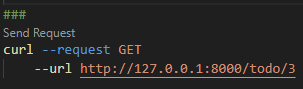
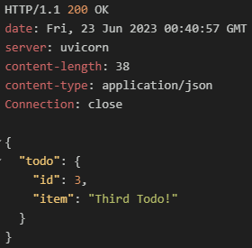
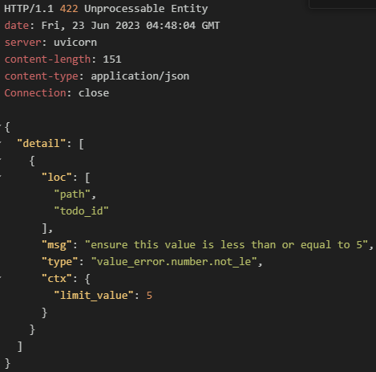

# 3. 경로 매개변수와 쿼리 매개변수
#### 3.1 경로 매개변수
- url에 포함된 값
- /todo/{todo_id} 형태의 url이 존재한다면 {todo_id}부분이 경로 매개변수
- url의 일부로 전달되기 때문에 적절히 인코딩한 값을 전달하여야 함
<br/>
<br/>

##### 3.1.1 경로 매개변수 사용 예시
- 경로 매개변수로 todo_id값을 받아 해당 id의 todo만 추출하는 라우트생성.
   ##### todo.py
  

<br/>

- DB상에 데이터가 아래와 같이 존재할 때  
  
  

<br/>

- 경로매개변수를 사용해 특정ID값 추출
  
|  |  |
| ------------------------------- | ------------------------------- |

<br/>

##### 3.1.2 경로 매개변수에 Path 사용
- Path란?
  - 경로 매개변수에 유효성 검사 등 추가기능을 부여할 수 있는 클래스
  - Swagger, ReDoc등으로 OpenAPI 기반 문서를 자동 생성할 때 라우트 관련 정보를 함께 문서화하도록 도움  

##### todo.py
```python
@todo_router.get("/todo/{todo_id}")
async def get_single_todo(
    todo_id: int = Path(
        ...,
        title="Title of Path Parameter",
        description="Description of Path Parameter",
        gt=0,
        le=5,
    )
) -> dict:
    for todo in todo_list:
        if todo.id == todo_id:
            return {"todo": todo}

    return {"message": "Todo with supplied ID doesn`t exist."}
```

##### FastAPI 문서 화면


##### 경로 파라미터를 사용한 GET 요청

- Path()에서 지정한 범위인 0~5를 벗어난 파라미터로 호출하는경우
  
|  |  |
| ------------------------------- | ------------------------------- |

<br/>
<br/>

#### 3.2 쿼리 매개변수
- 선택사항이며 일반적으로 URL에서 ? 뒤에 위치
- 제공된 쿼리를 기반으로 특정값을 반환하거나 요청을 필터링할 때 사용
```python
async def query_route(query: str = Query(None)):
  return query
```