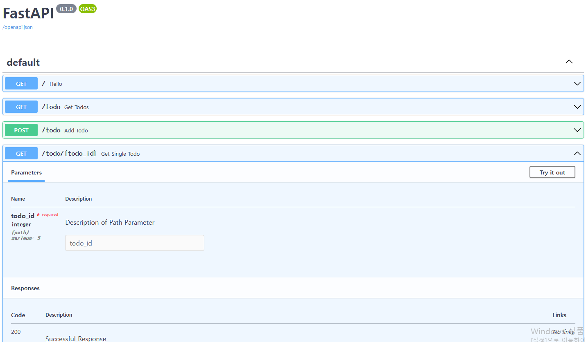
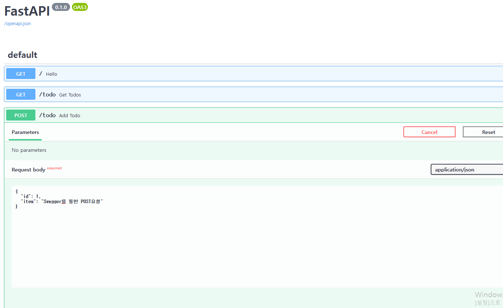
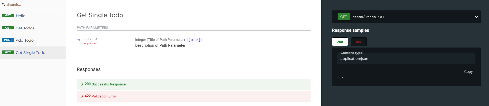
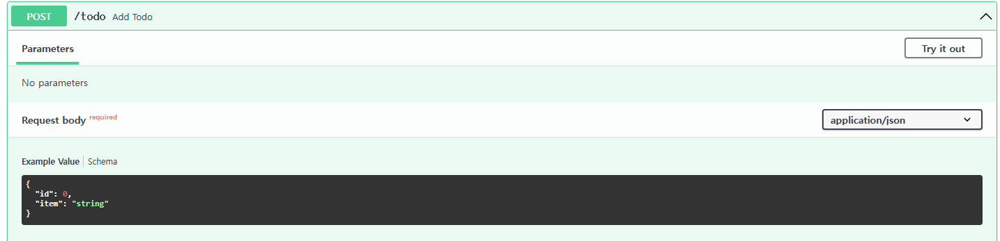

# 4. 요청 바디
#### 4.1 요청 바디 설명
- POST, UPDATE 등 라우팅 메서드를 사용해 API로 전달되는 데이터

- 위 POST요청의 data{} 부분이 요청 바디이다.
<br/>
<br/>

#### 4.2 FastAPI 자동 문서화
- FastAPI는 JSON 스키마 정의를 생성하고 라우트, 요청바디의 유형, 경로 및 쿼리 매개변수, 응답 모델 등을 자동으로 문서화한다.
- 문서는 Swagger / ReDoc 두가지 유형으로 제공된다.

##### 4.2.1 Swagger
- 애플리케이션 주소 끝에 /docs를 붙여 접속 가능
- 인터렉티브 문서(사용자가 실행할 수 있는문서)를 제공하여 API 테스트 가능
- Swagger 화면
<br/>


<br/>
<br/>

- 인터렉티브 문서를 사용한 메서드 테스트 예시
<br/>

##### 요청 바디 작성 후 execute하여 POST 전송 


<br/>
<br/>

##### 4.2.2 ReDoc
- 애플리케이션 주소 끝에 /redoc을 붙여 접속 가능
- 모델, 라우트, API에 관한 정보를 더 직관적이고 상세하게 전달
- ReDoc 화면
<br/>



- 스키마에 Config클래스를 작성하여 샘플데이터를 작성할 수 있다.
  아래와 같이 todo파일을 수정하여 확인해보자.

##### todo.py
  ```python
  class Todo(BaseModel):
    id: int
    item: str

    class Config:
      schema_extra = {
        "example": {
          "id": 1,
          "item": "Example Schema!"
        }
      }
  ```

<br/>

##### 샘플스키마를 작성한 후 ReDoc화면
 

<br/>

##### Swagger에서도 샘플스키마 확인 가능
