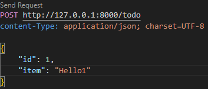
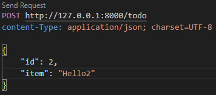
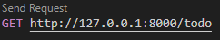
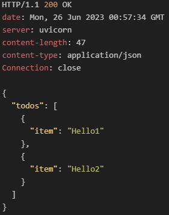

# 1. 응답

#### 1.1 FastAPI의 응답
- API 처리 과정의 한 부분으로, HTTP 메서드를 통해 API와 상호작용하며
  API로부터 받은 결과를 말한다.
- 보통 JSON 또는 XML 형식이지만 문서형식으로 전달되기도 하며 header와 body로 구성된다.

<br/>

>응답 헤더
>
>- 요청 상태 및 응답 바디 전달을 안내하는 정보로 구성된다
>
>- 응답 헤더의 예로는 Content-Type이 있으며 반환하는 컨텐츠유형이 무엇인지 클라이언트에게 알려주는 역할을 한다.

<br/>

>응답 바디
>
>- 서버가 클라이언트에게 반환하는 데이터
>- 응답 바디의 형식은 Content-Type에 의해 결정되며 예로 application/json이 있다.
>- 앞 장에서 서버가 반환한 todo_list가 응답 바디에 해당한다.

<br/>

>상태 코드
>
>- 서버가 반환한 응답에 포함되는 짧은 고유코드로, 클라이언트가 보낸 요청의 상태를 나타냄
>- 크게 다섯개의 그룹으로 분류할 수 있다.
>   - 1XX : 요청을 받음
>   - 2XX : 요청을 성공적으로 처리함
>   - 3XX : 요청을 리다이렉트함
>   - 4XX : 클라이언트측에 오류가 있음
>   - 5XX : 서버 측에 오류가 있음
>- 대표적인 상태코드 : 200(성공) / 404(페이지를 찾을 수 없음) / 500(서버 내부 오류)

#### 1.2 응답 모델 작성
- pydantic을 사용해 작성

##### 1.2.1 응답 모델 작성 예시
- TodoItem형태의 List를 반환하는 TodoItems 스키마 작성
- id없이 item값만 존재하는 리스트를 반환
###### schemas.py
```python
from pydantic import BaseModel
from typing import List


class TodoItem(BaseModel):
    item: str

    class Config:
        schema_extra = {"example": {"item": "Example Schema"}}


class TodoItems(BaseModel):
    todos: List[TodoItem]

    class Config:
        schema_extra = {
            "example": {
                "todos": [{"item": "Example schema 1"}, {"item": "Example schema 2"}]
            }
        }
```

<br/>

###### todo.py
```python
from fastapi import APIRouter
from .schemas import TodoItem, TodoItems

todo_router = APIRouter()
todo_list = []

@todo_router.get("/todo", response_model=TodoItems)
async def get_todos() -> dict:
    return {"todos": todo_list}
```

<br/>

| 요청                                                                                                              | 응답                                  |
| ----------------------------------------------------------------------------------------------------------------- | ------------------------------------- |
|    |  |
