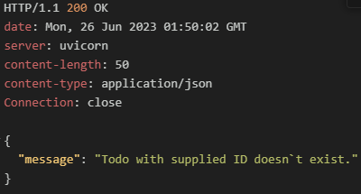
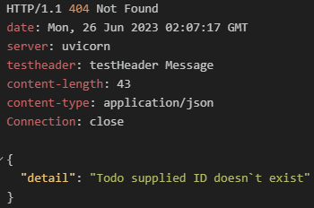
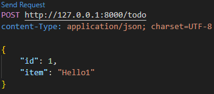
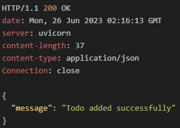
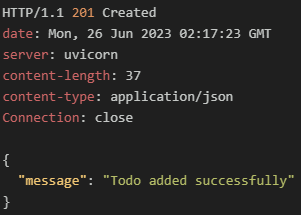

# 2. 오류 처리
- FastAPI에서 오류는 HTTPException 클래스를 사용해 예외를 발생시켜 처리한다.
  
- HTTPException클래스는 다음 세 개의 인수를 받는다.
>HTTPException에서 받는 세개의 인수
>   - status_code: 예외 처리 시 반환할 상태 코드
>   - detail: 클라이언트에게 전달한 메시지
>   - headers: 헤더를 요구하는 응답을 위한 선택적 인수

<br/>

#### 2.1 경로 매개변수를 사용한 라우트에서 200메시지반환대신 404오류 발생시키기
- 기존 작성한 코드는 존재하지 않는 {todo_id}요청 시 아래와 같은 결과를 반환한다.
  
| 요청                                  | 응답                                  |
| ------------------------------------- | ------------------------------------- |
|  |  |

<br/>

- HTTPException클래스를 사용해 200대신 404오류를 응답하도록 변경해보자.
  
###### todo.py
```python
from fastapi import APIRouter, HTTPException, status
...
# todo 한개 SELECT
@todo_router.get("/todo/{todo_id}")
async def get_single_todo(todo_id: int) -> dict:
    for todo in todo_list:
        if todo.id == todo_id:
            return {
                "todo": todo
            }
    raise HTTPException(
        status_code=status.HTTP_404_NOT_FOUND,
        detail="Todo supplied ID doesn`t exist",
        headers={"testHeader": "testHeader Message"},
    )


# todo 한개 UPDATE
@todo_router.put("/todo/{todo_id}")
async def update_todo(
    todo_data: TodoItem,
    todo_id: int = Path(..., title="The ID of the todo to be updated"),
) -> dict:
    for todo in todo_list:
        if todo.id == todo_id:
            todo.item = todo_data.item
            return {"message": "Todo updated successfully"}
    raise HTTPException(
        status_code=status.HTTP_404_NOT_FOUND,
        detail="Todo supplied ID doesn`t exist",
        headers={"testHeader": "testHeader Message"},
    )


# todo 한개 DELETE
@todo_router.delete("/todo/{todo_id}")
async def delete_single_todo(
    todo_id: int = Path(..., title="The ID of the todo to be deleted")
) -> dict:
    for index in range(len(todo_list)):
        todo = todo_list[index]
        if todo.id == todo_id:
            todo_list.pop(index)
            return {"message": "Todo deleted successfully"}
    raise HTTPException(
        status_code=status.HTTP_404_NOT_FOUND,
        detail="Todo supplied ID doesn`t exist",
        headers={"testHeader": "testHeader Message"},
    )    
```

<br/>

- 코드 변경 후 존재하지 않는 todo_id요청 시 200이 아닌 404오류를 응답하는 것을 확인
  
| 요청                                  | 응답                                  |
| ------------------------------------- | ------------------------------------- |
|  |  |

<br/>

- post요청 성공 시 기본 응답 코드(200)을 리소스 생성(201) 코드로 변경해보자
###### todo.py
```python
@todo_router.post("/todo", status_code=201)
async def add_todo(todo: Todo) -> dict:
    todo_list.append(todo)
    return {
        "message": "Todo added successfully"
    }
```

<br/>

- 코드 변경된 결과 확인
  
| 요청                                  | 변경전응답                            | 변경후 응답                           |
| ------------------------------------- | ------------------------------------- | ------------------------------------- |
|  |  |  |