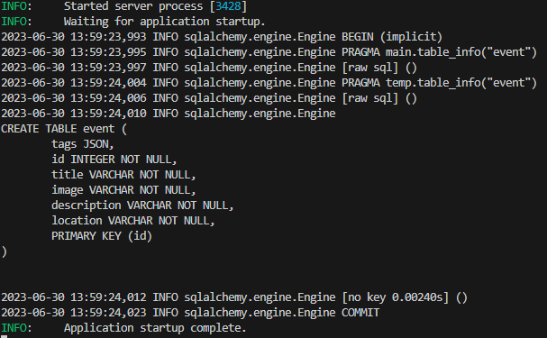

# 1. SQLModel 
  - FastAPI 개발자가 만들었으며 pydantic과 SQLAlchemy를 기반으로 한다.
  - 내장 모듈이 아니기에 따로 설치 해줘야 한다.
    >(venv)$ pip install sqlmodel 

<br/>

#### 1.1 테이블
- SQLModel을 사용해서 테이블을 생성하려면 테이블 모델 클래스를 먼저 정의해야 한다.
- pydantic 스키마 클래스처럼 정의하지만 SQLModel의 서브클래스로 정의해야 한다.
- 클래스 정의는 table이라는 설정 변수를 가지며 이 변수를 통해 해당 클래스가 SQLModel 테이블 이라는 것을 인식한다.
- 모델 클래스 안에 정의된 변수는 따로 지정하지 않으면 기본 필드로 설정된다. (사용 시 기본값을 반드시 제공해줘야하며 그렇지 않을 시 validationError발생)

<br/>

- Event테이블 모델 정의

###### /models/events.py
```python
from sqlmodel import SQLModel, JSON, Field, Column
from typing import Optional, List


class Event(SQLModel, table=True):
    id: int = Field(default=None, primary_key=True)
    title: str
    image: str
    description: str
    location: str
    tags: List[str] = Field(sa_column=Column(JSON))

    class Config:
        arbitrary_types_allowed = True
        schema_extra = {
            "example": {
                "title": "FastAPI Book",
                "image": "http://limktomyimage.com/image.png",
                "description": "this is description",
                "location": "Google Meet",
                "tags": ["python", "fastapi", "book", "launch"],
            }
        }

```

#### 1.2 로우
- 로우에 데이터를 추가하고 저장하려면 테이블의 인스턴스를 만든 후 인스턴스의 변수에 원하는 데이터를 할당해야 한다. 다음은 하나의 이벤트 데이터를 이벤트 테이블에 추가하는 예시이다.

```python
new_event = Event(title="Book Launch",
                  image="src/fastapi.png", 
                  description="description..blahblah",
                  location="Google Meet",
                  tags=["packt", "book"])

with Session(engine) as session:
  session.add(new_event)
  session.commit()
```
- 세션관련 생소한 코드가 나왔다. 이제 세션을 알아보자.

#### 1.3 세션
- 세션 객체는 코드와 데이터베이스 사이에서 이루어지는 처리를 관리하며 주로 특정 처리를 데이터베이스에 적용하기 위해 사용된다.
- Session 클래스는 SQL 엔진의 인스턴스를 인수로 사용한다.
- Session 클래스의 메서드
  - add() : 처리 대기중인 데이터베이스 객체를 메모리에 추가한다. 앞서 살펴본 코드에서 
    new_event 객체는 세션 메모리에 추가되고 commit() 메서드에 의해 데이터베이스에 실제로 반영된다.
  - commit() : 현재 세션에 있는 트랜잭션을 실제 데이터베이스에 모두 반영한다.
  - get() : 데이터베이스에서 단일 로우를 추출한다. 모델과 pk값인 id를 사용한다.

<br/>

# 2. DATABASE 생성 및 Event model추가
- SQLModel에서는 SQLAlchemy 엔진을 사용해서 데이터베이스를 연결
- SQLAlchemy 엔진은 create_engine() 메서드를 사용해서 생성
- create_engine() 메서드는 데이터베이스 URL을 인수로 사용
- 데이터베이스 URL은 sqlite:///database.db 또는 sqlite:///database.sqlite와 같은 형식
- create_engine()은 echo를 선택적 인수로 지정할 수 있으며 True로 설정하면 실행된 SQL명령을 출력한다.
- create_engine() 메서드만으로는 데이터베이스파일을 만들 수 없고 create_all(engine)메서드를 사용해야 한다.

```python
database_file = "database.db"
engine = create_engine(database_file, echo=True)
SQLModel.metadata.create_all(engine)
```

- create_all() 메서드는 데이터베이스뿐만 아니라 테이블도 생성한다. 중요한점은 데이터베이스 연결파일(connection.py)에서 테이블 파일을 import해야 한다는 것이다.

- 이벤트플래너 애플리케이션에 데이터베이스를 연동해보자.
  
#### 2.1 UPDATE처리의 바디유형으로 사용할 모델 추가

###### /models/events.py
```python
class EventUpdate(SQLModel):
    title: Optional[str]
    image: Optional[str]
    description: Optional[str]
    tags: Optional[List[str]] 
    location: Optional[str]
                       
    class Config:
        schema_extra = {
            "example": {
                "title": "FastAPI Book Launch",
                "image": "https://linktomyimage.com/image.png",
                "description": "this is description",
                "tags": ["python","fastapi","book" ,"lunch"],
                "location": "Google Meet"
            }
        }
```

<br/>


#### 2.2 데이터베이스 연결파일 작성

###### /database/connection.py
```python
from sqlmodel import SQLModel, Session, create_engine


database_file = "planner.db"
database_connection_string = f"sqlite:///{database_file}"
connect_args = {"check_same_thread": False}
engine_url = create_engine(
    database_connection_string, echo=True, connect_args=connect_args
)


def conn():
    SQLModel.metadata.create_all(engine_url)


def get_session():
    with Session(engine_url) as session:
        yield session
```
<br/>


#### 2.3 main 실행 시 데이터베이스 연결

###### /database/main.py에 아래 코드 추가
```python
from database.connection import conn


@app.on_event("startup")
def on_startup():
  conn()
```
###### 코드 작성 후 실행결과


- 데이터베이스 엔진 생성 시에 echo=True로 설정하면 위와같이 SQL명령이 출력된다.

