# 3. 이벤트 라우트 변경
#### 3.1 이벤트 생성
- 기존 작성한 routes/events.py의 이벤트생성을 db상에 반영하도록 변경

###### routes/events.py
```python
from fastapi import APIRouter, Depends, HTTPException, Request, status
from ..models.events import Event, EventUpdate
from database.connection import get_session

# 이벤트 생성
@event_router.post("/new")
async def create_event(new_event: Event, session=Depends(get_session)) -> dict:
    session.add(new_event)
    session.commit()
    session.refresh(new_event)

    return {"message": "Event created successfully."}
```

<br/>

###### routes/events.py
| 요청                                  | 응답                                 |
| ------------------------------------- | ------------------------------------ |
| 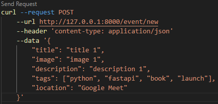 | 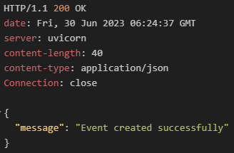 |

<br/>

#### 3.2 이벤트 조회
- 기존 작성한 routes/events.py의 이벤트조회를 db를 반영하도록 변경

###### routes/events.py
```python
from sqlmodel import select

# 모든 이벤트 조회
@event_router.get("/", response_model=List[Event])
async def retrieve_all_events(session=Depends(get_session)) -> List[Event]:
    statement = select(Event)
    events = session.exec(statement).all()
    return events


# 특정 이벤트 조회
@event_router.get("/{id}", response_model=Event)
async def retrieve_event(id: int, session=Depends(get_session)) -> Event:
    event = session.get(Event, id)
    if event:
        return event

    raise HTTPException(
        status_code=status.HTTP_404_NOT_FOUND,
        detail="Event with supplied ID does not exist",
    )
```

<br/>

###### routes/events.py
| 요청                                  | 응답                                  |
| ------------------------------------- | ------------------------------------- |
| 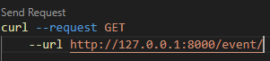 | 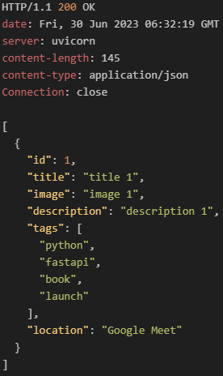 |
| 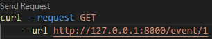 | 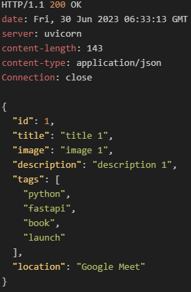 |

<br/>

#### 3.3 이벤트 변경
- 기존 작성한 routes/events.py에 이벤트변경 라우트를 추가
- 이벤트를 변경한 후 변경한 데이터를 반환하는 함수

###### routes/events.py
```python
from sqlmodel import select

# 이벤트 변경
@event_router.put("/{id}", response_model=Event)
async def update_event(id: int, new_data: EventUpdate, session=Depends(get_session)) -> Event:
    event = session.get(Event, id)
    if event:
        event_data = new_data.dict(exclude_unset=True)
        for key, value in event_data.items():
            setattr(event, key, value)
        session.add(event)
        session.commit()
        session.refresh(event)

        return event
    raise HTTPException(
        status_code = status.HTTP_404_NOT_FOUND,
        detail="Event with suppliedID does not exist"
    )
```

> - exclude_unset=True  
>   dict()나 json() 메서드에서 사용되는 매개변수로 True가 할당되면 모델 인스턴스에서
>   값이 설정되지 않은 필드를 제외시킨 후 dict()형식 또는 json()형식으로 반환
> 
> - setattr()  
>   객체의 속성값을 동적으로 설정하는 함수
>   setattr(object, attribute, value)
>     - object: 속성을 설정할 객체
>     - attribute: 설정할 속성의 이름
>     - value: 설정할 속성의 값

<br/>

###### routes/events.py
| 요청                                  | 응답                                  |
| ------------------------------------- | ------------------------------------- |
| 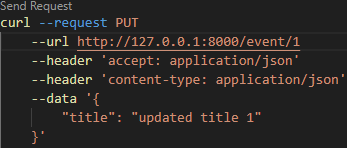 | 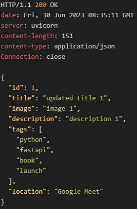 |

<br/>

#### 3.4 이벤트 삭제
- 기존 작성한 routes/events.py의 이벤트삭제를 db를 반영하도록 변경

###### routes/events.py
```python
# 이벤트 삭제
@event_router.delete("/{id}")
async def delete_event(id: int, session=Depends(get_session)) -> dict:
    event = session.get(Event, id)
    if event:
        session.delete(event)
        session.commit()
        return {"message": "Event deleted successfully."}

    raise HTTPException(
        status_code=status.HTTP_404_NOT_FOUND,
        detail="Event with supplied ID does not exist",
    )
```

<br/>

###### routes/events.py
| 요청                                  | 응답                                  |
| ------------------------------------- | ------------------------------------- |
| 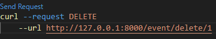 | 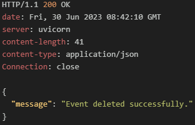 |

<br/>

- 삭제되었는지 전체 이벤트 조회로 확인
###### routes/events.py
| 요청                                   | 응답                                   |
| -------------------------------------- | -------------------------------------- |
| 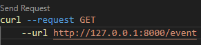 | 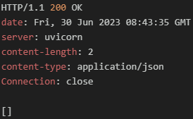 |