# 4. 몽고DB 설정부분을 sqlite로 설정

##### 4.2.1 사용자 모델 변경

###### /models/users.py
```python
from pydantic import EmailStr
from sqlmodel import SQLModel, JSON, Field, Column
from typing import Optional, List
from .events import Event


class User(SQLModel, table=True):   # BaseModel대신 SQLModel을 상속
    id: int = Field(default=None, primary_key=True)
    email: EmailStr
    username: str
    password: str
    events: Optional[List[Event]] = Field(sa_column=Column(JSON))

    class Config:
        schema_extra = {
            "example": {
                "email": "fastapi@packt.com",
                "username": "John",
                "password": "pwd123!",
                "events": [],
            }
        }


class UserSignIn(SQLModel): # BaseModel대신 SQLModel을 상속
    email: EmailStr
    password: str

    class Config:
        schema_extra = {
            "example": {
                "email": "fastapi@packt.com",
                "password": "Jhon",
            }
        }
```

<br/>

> 💡 Field()는?  
> Path와 비슷하게 스키마 내의 특정필드에 추가정보나 기능, 유효성검사조건 등을 부여할 수 있다.  
> 아래와 같은 속성들을 사용할 수 있다.
> 

##### 4.2.2 사용자 라우트 변경

###### /routes/users.py
```python
from fastapi import APIRouter, HTTPException, status, Depends
from ..models.users import User, UserSignIn
from ..database.connection import get_session
from sqlmodel import select

user_router = APIRouter(
    tags=["User"],
)


# 사용자 등록
@user_router.post("/signup")
async def sign_new_user(new_user: User, session=Depends(get_session)) -> dict:
    # 등록된 사용자인지 체크
    select_user_exist = select(User).where(User.email == new_user.email)
    results = session.exec(select_user_exist)

    if results.first():
        raise HTTPException(
            status_code=status.HTTP_409_CONFLICT,
            detail="User with supplied email exists",
        )

    # 등록된 사용자가 아니면 INSERT
    session.add(new_user)
    session.commit()
    session.refresh(new_user)
    return {"message": "Event created successfully."}


# 사용자 로그인
@user_router.post("/signin")
async def sign_user_in(user: UserSignIn, session=Depends(get_session)) -> dict:
    # 등록된 사용자인지 체크
    user_exist = select(User).where(User.email == user.email)
    results = session.exec(user_exist)
    first = results.first()

    if not first:
        raise HTTPException(
            status_code=status.HTTP_404_NOT_FOUND, detail="User does not exist"
        )

    # 패스워드가 일치하는지 체크
    if first.password == user.password:
        return {"message": "User signed in successfully"}

    # 패스워드 불일치시 Exception 발생
    raise HTTPException(
        status_code=status.HTTP_403_FORBIDDEN, detail="Wrong credentials passed"
    )

```

<br/>

#### 4.2.3 이벤트 CRUD요청 및 응답 확인

|                | 요청                                                                               | 응답                                       |
| -------------- | ---------------------------------------------------------------------------------- | ------------------------------------------ |
| 생성           | 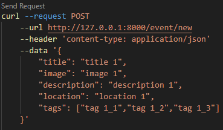 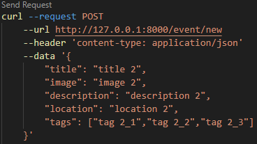 | 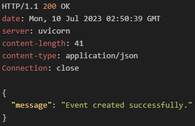  |
| 모든이벤트조회 | 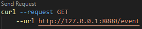                                          |   |
| 단일이벤트조회 |                                           | 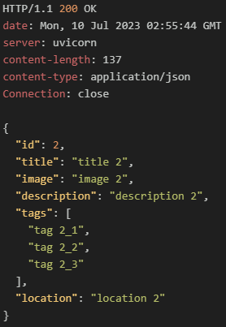  |
| 수정           | 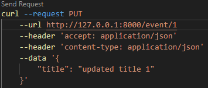                                          | 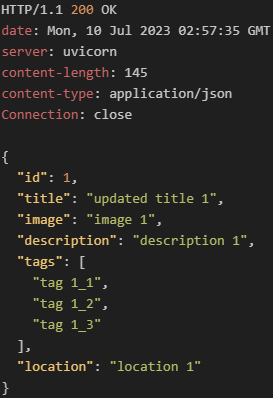  |
| 삭제           | 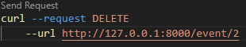                                         | 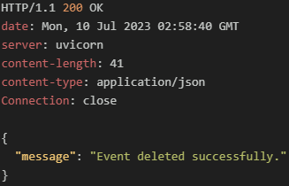 |

<br/>
<br/>

#### 4.2.4 사용자 등록 및 로그인인증 확인

##### 4.2.4.1 사용자 등록

- case 1. 사용자 정상 등록
  
| 요청                                       | 응답                                       |
| ------------------------------------------ | ------------------------------------------ |
|  | 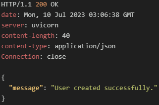 |

<br/>

- case 2. db상에 동일한 사용자가 존재할 경우

| 요청                                       | 응답                                       |
| ------------------------------------------ | ------------------------------------------ |
|  | 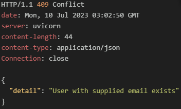 |

<br/>

- case 3. 이메일타입 오류
  
| 요청                                       | 응답                                       |
| ------------------------------------------ | ------------------------------------------ |
| 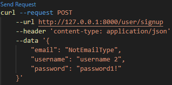 | 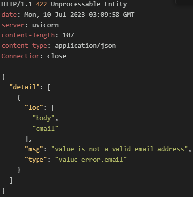 |

<br/>
<br/>

##### 4.2.4.1 사용자 로그인

- case 1. 정상 로그인

| 요청                                       | 응답                                       |
| ------------------------------------------ | ------------------------------------------ |
| 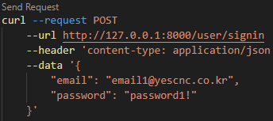 | 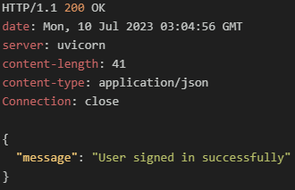 |

<br/>

- case 2. id가 존재하지 않을 경우

| 요청                                       | 응답                                       |
| ------------------------------------------ | ------------------------------------------ |
| 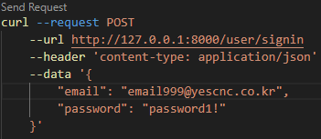 |  |

<br/>

- case 3. password가 일치하지 않을 경우

| 요청                                       | 응답                                       |
| ------------------------------------------ | ------------------------------------------ |
| 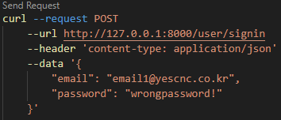 | 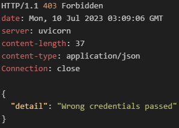 |