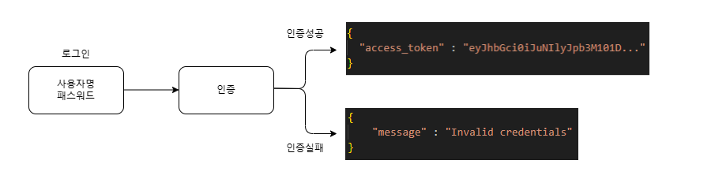
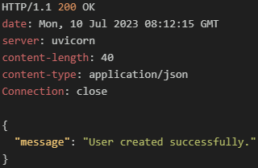
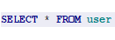
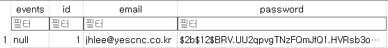

# 2. OAuth2와 JWT를 사용한 애플리케이션 보안

###### 인증 흐름


#### 2.1 인증 기능 구조화
- 이벤트플래너 애플리케이션에 인증 기능을 추가하기 위해 폴더 및 파일추가

      planner/
          auth/
            jwt_handler.py
            authenticate.py
            hash_password.py
  - jwt_handler.py : JWT문자열을 인코딩 / 디코딩
  - authenticate.py : authenticate 의존 라이브러리가 포함되며 인증 및 권한을 위해 라우트에 주입된다.
  - hash_password.py : 패스워드를 암호화하는 함수가 포함된다. 계정을 등록하거나 로그인 시 패스워드 비교에 사용됨

#### 2.2 패스워드 해싱
- 데이터베이스 연결에서 사용자 패스워드를 일반텍스트로 저장했었는데 bcrypt를 사용해 암호화 해보자.

> 💡 bcrypt란?  
> 
>  bcrypt는 비밀번호를 해싱하는데 사용하는 함수이다.  
>  해싱이란 입력으로 받은 데이터를 고정된 길이의 해시 값으로 변환하는 알고리즘을 말한다.

<br/>

##### 2.2.1 passlib 라이브러리 설치
> (venv)$ pip install passlib[bcrypt]

<br/>

##### 2.2.2 패스워드를 해싱하는 함수 작성

###### /auth/hash_password.py
```python
from passlib.context import CryptContext

pwd_context = CryptContext(schemes=["bcrypt"], deprecated="auto")


class HashPassword:
    def create_hash(self, password: str):
        return pwd_context.hash(password)

    def verify_hash(self, plain_password: str, hashed_password: str):
        return pwd_context.verify(plain_password, hashed_password)
```
  - create_hash() : 문자열을 해싱한 값을 반환
  - verify_hash() : 일반 텍스트 패스워드와 해싱한 패스워드를 인수로 받아 두 값이 일치하는지 비교한다. 일치 여부에 따라 boolean값을 반환
  
<br/>

##### 2.2.3 패스워드값을 해싱한 값으로 저장하도록 사용자등록 함수 변경

###### /routes/users.py
```python
from fastapi import APIRouter, HTTPException, status, Depends
from ..auth.hash_password import HashPassword #added
from ..database.connection import get_session
from ..models.users import User, UserSignIn
from sqlmodel import select

user_router = APIRouter(
    tags=["User"],
)
hash_password = HashPassword() #added

# 사용자 등록
@user_router.post("/signup")
async def sign_new_user(new_user: User, session=Depends(get_session)) -> dict:
    # 등록된 사용자인지 체크
    select_user_exist = select(User).where(User.email == new_user.email)
    results = session.exec(select_user_exist)
    user_exist = results.first()

    if user_exist:
        raise HTTPException(
            status_code=status.HTTP_409_CONFLICT,
            detail="User with supplied email exists",
        )

    # 등록된 사용자가 아니면 INSERT
    hashed_password = hash_password.create_hash(new_user.password) #added
    new_user.password = hashed_password #added
    session.add(new_user)
    session.commit()
    session.refresh(new_user)
    return {"message": "User created successfully."}
```

<br/>

##### 2.2.4 해싱된 패스워드값으로 DB에 저장되는지 테스트

###### 사용자등록 실행 및 결과 확인
| 요청                                  | 결과                                  |
| ------------------------------------- | ------------------------------------- |
|   |  |
|  |  |

<br/>
<br/>

#### 2.3 액세스 토큰 생성과 검증
- JWT를 구현하면 애플리케이션의 보안을 한 단계 더 강화할 수 있다.
- 
> 💡 토큰이란?  
> - 보안과 인증을 위해 사용되는 문자열로, 주로 클라이언트가 자원에 접근할 때 신원을 증명하거나 권한을 부여하는데 사용된다.
> - 서버에서 발급되고 클라이언트에게 전달된다. 클라이언트는 이 토큰을 사용하여 인증된 요청을 보낼 수 있고 서버는 토큰을 검증하여 요청을 승인할 수 있다.
>
> - 주로 사용되는 토큰 기반 인증 방식
>   - JWT(JSON Web Token): 웹 표준으로 정의된 토큰 형식
>   - OAuth: 서드파티 인증을 위한 프로토콜

###### 토큰의 세가지 구성요소
| 헤더(Header)                                        | 페이로드(Payload)                                                                                                    | 서명(Signature)                                                                                                    |
| --------------------------------------------------- | -------------------------------------------------------------------------------------------------------------------- | ------------------------------------------------------------------------------------------------------------------ |
| 토큰의 타입과 암호화 알고리즘을 지정하는 메타데이터 | 토큰에 포함되는 클레임(claim)정보. 클레임은 토큰의 내용에 대한 정보를 포함한다. 예를들어 사용자ID, 권한, 만료시간 등 | 토큰의 무결성을 검증하기 위한 서명. 서명은 비밀키를 사용하여 생성되며, 헤더와 페이로드의 내용을 기반으로 생성된다. |

<br/>

##### 2.3.1 JWT인코딩, 디코딩용 jose 라이브러리 설치
> pip install python-jose[cryptography] python-multipart

<br/>

##### 2.3.2 SECRET_KEY 작성 및 사용

###### .env
```
SECRET_KEY=HI5HL3V3L$3CR3T
```

###### /database/connection.py
```python
from pathlib import Path
from dotenv import load_dotenv

env_path = Path(__file__).resolve().parent.parent / ".env"
load_dotenv(env_path)


class Settings(BaseSettings):
    SECRET_KEY: Optional[str] = None

    class Config:
        env_file = ".env"
```

<br/>

##### 2.3.3 jwt_handler파일 작성

###### /auth/jwt_handler.py
```python
import time
from datetime import datetime

from fastapi import HTTPException, status
from jose import jwt, JWTError
from ..database.connection import Settings

settings = Settings()


# 토큰 생성 함수
def create_access_token(user: str):
    payload = {"user": user, "expires": time.time() + 3600}

    token = jwt.encode(payload, settings.SECRET_KEY, algorithm="HS256")
    return token


# 토큰 검증 함수
def verify_access_token(token: str):
    try:
        data = jwt.decode(token, settings.SECRET_KEY, algorithms=["HS256"])
        expire = data.get("expires")

        if expire is None:
            raise HTTPException(
                status_code=status.HTTP_400_BAD_REQUEST,
                detail="No access token supplied",
            )
        if datetime.utcnow() > datetime.utcfromtimestamp(expire):
            raise HTTPException(
                status_code=status.HTTP_403_FORBIDDEN, detail="Token expired!"
            )
        return data

    except JWTError:
        raise HTTPException(
            status_code=status.HTTP_400_BAD_REQUEST, detail="Invalid token"
        )
```

#### 2.4 사용자 인증
- JWT 생성 및 디코딩하는 컴포넌트, 패스워드 해싱 및 비교 컴포넌트를 구현했으니 이벤트 라우트에 주입할 의존 라이브러리를 만든다. 

```python
from fastapi import Depends, HTTPException, status
from fastapi.security import OAuth2PasswordBearer
from auth.jwt_handler import verify_access_token

oauth2_scheme = OAuth2PasswordBearer(tokenUrl="/user/signin")


async def authenticate(token: str = Depends(oauth2_scheme)) -> str:
    if not token:
        raise HTTPException(
            status_code=status.HTTP_403_FORBIDDEN, detail="Sign in for access"
        )

    decoded_token = verify_access_token(token)
    return decoded_token["user"]
```

