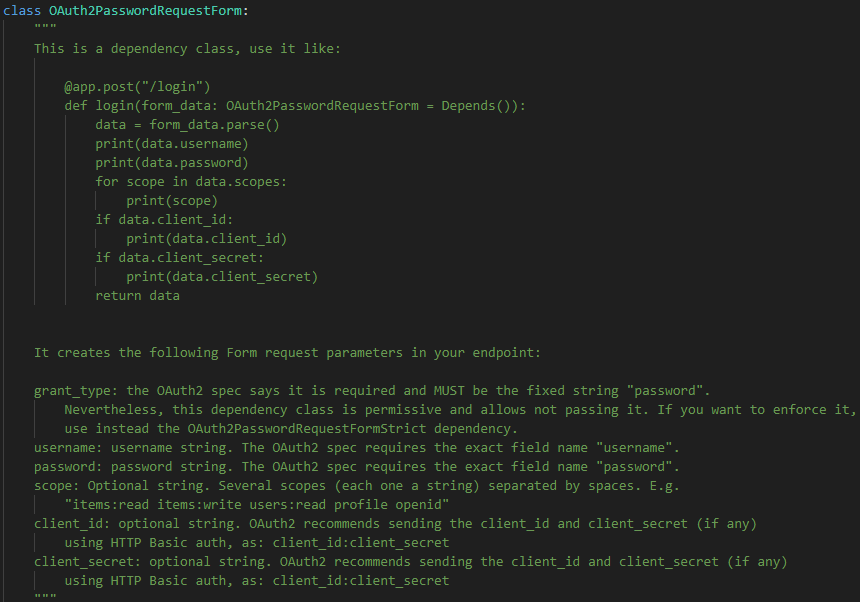
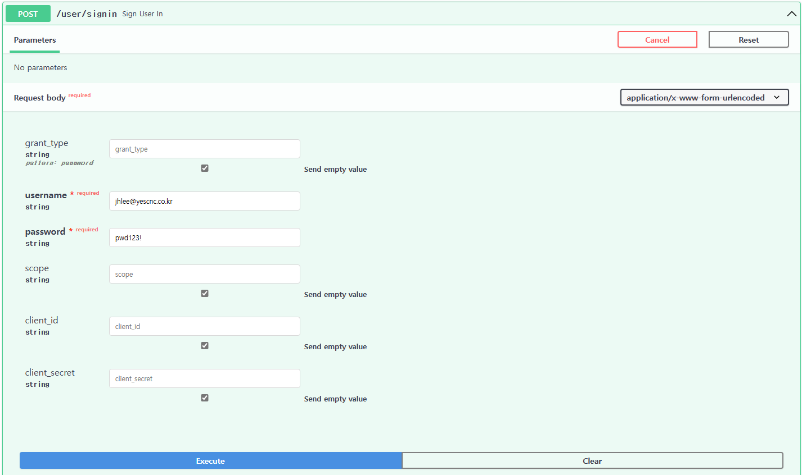
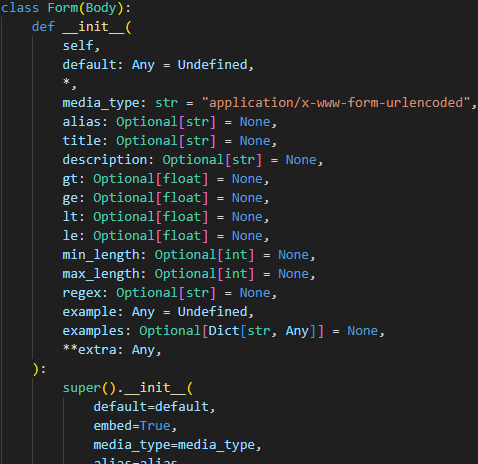
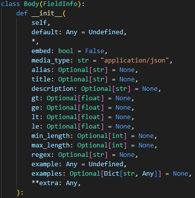
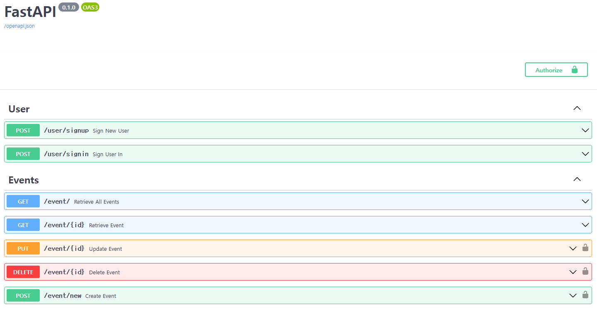

# 3. 이벤트플래너 애플리케이션에 인증모델 적용

#### 3.1 로그인 라우트 변경
- OAuth2PasswordRequestForm 클래스를 sign_user_in() 라우트 함수에 주입하여 사용
- x-www-form-urlencoded 타입으로 요청하고 json타입으로 응답

<br/>

##### 3.1.1 로그인 라우팅함수 변경

###### /routes/users.py
```python
from fastapi import APIRouter, Depends, HTTPException, status
from fastapi.security import OAuth2PasswordRequestForm

from ..auth.jwt_handler import create_access_token


@user_router.post("/signin", response_model=TokenResponse)
async def sign_user_in(
    user: OAuth2PasswordRequestForm = Depends(), session=Depends(get_session)
) -> dict:
    """사용자 로그인"""

    # DB에 존재하는 이메일 정보 가져옴
    select_user_exist = select(User).where(User.email == user.username)
    results = session.exec(select_user_exist)
    user_exist = results.first()

    # 존재 하지 않는다면 HTTPException
    if not user_exist:
        raise HTTPException(
            status_code=status.HTTP_404_NOT_FOUND, detail="User does not exist"
        )

    # 패스워드가 일치하는지 인증정보 비교 후 인증에 성공하면 토큰 발행
    if hash_password.verify_hash(user.password, user_exist.password):
        access_token = create_access_token(user_exist.email)
        return {"access_token": access_token, "token_type": "Bearer"}

    # 패스워드 불일치시 Exception 발생
    raise HTTPException(
        status_code=status.HTTP_401_UNAUTHORIZED, detail="Invalid details passed"
    )
```

<br/>

##### 3.1.2 OAuth2PasswordRequestForm 클래스

###### /fastapi/security/oauth2.py


| 파라미터명               | 설명                                                                                                                                                                                                                                                                                                                                                                                                                                        |
| ------------------------ | ------------------------------------------------------------------------------------------------------------------------------------------------------------------------------------------------------------------------------------------------------------------------------------------------------------------------------------------------------------------------------------------------------------------------------------------- |
| grant_type               | 인증방식을 선택하는데 사용된다. OAuth2.O 스펙에 따르면 이 값은  OAuth 2.0 인증 프로토콜에서 반드시 포함되어야 하는 필수 필드이다. 하지만 FastAPI의 OAuth2PasswordRequestForm클래스는 유연성을 제공하기 위해 grant_type필드가 포함되지 않았거나 값이 없는경우에도 사용할 수 있도록 만들어졌다. 명시하지 않는 경우 해당 필드엔 None값이 할당된다. 만약 grant_type을 강제로 요구하도록 하려면 OAuth2PasswordRequestFormStrict를 사용하면 된다. |
| username, password       | 인증에 사용                                                                                                                                                                                                                                                                                                                                                                                                                                 |
| scope                    | 인증된 사용자가 엑세스할 수 있는 권한의 범위를 지정하는데 사용하며 서비스 제공자가 정의한다. (예시: read, write, read write, ...)                                                                                                                                                                                                                                                                                                           |
| client_id, client_secret | 클라이언트 인증을 위해 사용. 클라이언트를 식별하고, 클라이언트의 인증정보를 검증하는데 사용된다.                                                                                                                                                                                                                                                                                                                                            |

<br/>

##### 3.1.3 요청바디가 OAuth2 사양를 따르는지 Swagger에서 확인


<br/>

💡request body의 형식이 application/x-www-form-urlencoded로 할당되는 이유?
> 로그인 라우팅 함수는 OAuth2PasswordRequestForm클래스를 의존성 주입하여 사용하고 있다.  
> 
> OAuth2PasswordRequestFrom클래스는 Form() 함수를 사용하고 있으며 Form()함수는 /fastapi/params.py에 정의된 Form클래스를 리턴한다.  
> 
> media_type 매개변수에 기본값으로 "application/x-www-form-urlencoded"를 할당해주고 있다.  
>  
> Form클래스는 또한 Body클래스의 서브클래스이고 Form에서 할당된 media_type의 값을 Body클래스에 할당한다. 이 과정에 의해 Body클래스에 "application/x-www-form-urlencoded"의 값이 할당되어 Swagger에서도 요청바디의 타입ㅇ

<br/>

| 위치       | 내용                     |
| ---------- | ------------------------ |
| def Form() |  |
| class Form |  |
| class Body |  |

##### 3.1.4 라우트 동작 테스트
| 요청                     | 응답                     |
| ------------------------ | ------------------------ |
|  |  |

<br/>
<br/>
<br/>

#### 3.2 이벤트 라우트 변경
- 인증된 사용자만이 이벤트를 변경,수정,삭제할 수 있도록 코드 변경
- POST, PUT, DELETE 라우트 함수에 인증정보 의존성 주입
  
##### 3.2.1 이벤트 라우팅함수 변경
```python
# 이벤트 생성
@event_router.post("/new")
async def create_event(
    body: Event,
    user: str = Depends(authenticate),
    session=Depends(get_session),
) -> dict:
    """이벤트 생성"""
    session.add(body)
    session.commit()
    session.refresh(body)

    return {"메시지": "이벤트가 생성되었습니다."}


@event_router.put("/{id}", response_model=Event)
async def update_event(
    body: EventUpdate,
    id: int = Path(
        ...,
        title="이벤트 ID",
        description="이벤트마다 부여되는 고유식별자, PK, 자동증가값",
    ),
    user: str = Depends(authenticate),
    session=Depends(get_session),
) -> Event:
    """이벤트 변경"""
    event = session.get(Event, id)
    if event:
        event_data = body.dict(exclude_unset=True)
        for key, value in event_data.items():
            setattr(event, key, value)
        session.add(event)
        session.commit()
        session.refresh(event)

        return event
    raise HTTPException(
        status_code=status.HTTP_404_NOT_FOUND,
        detail="제공된 ID에 해당하는 이벤트가 없습니다.",
    )


@event_router.delete("/{id}")
async def delete_event(
    id: int = Path(
        ...,
        title="이벤트 ID",
        description="이벤트마다 부여되는 고유식별자, PK, 자동증가값",
    ),
    user: str = Depends(authenticate),
    session=Depends(get_session),
) -> dict:
    """이벤트 삭제"""
    event = session.get(Event, id)
    if event:
        session.delete(event)
        session.commit()
        return {"메시지": "이벤트가 정상적으로 삭제되었습니다."}

    raise HTTPException(
        status_code=status.HTTP_404_NOT_FOUND,
        detail="제공된 ID에 해당하는 이벤트가 없습니다.",
    )
```

| 변경전                   | 변경후                   |
| ------------------------ | ------------------------ |
|  |  |