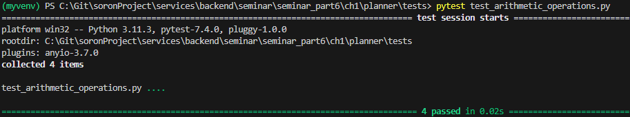
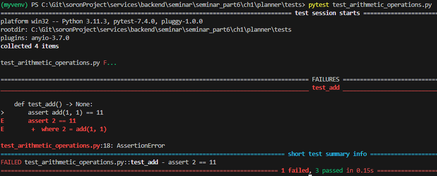
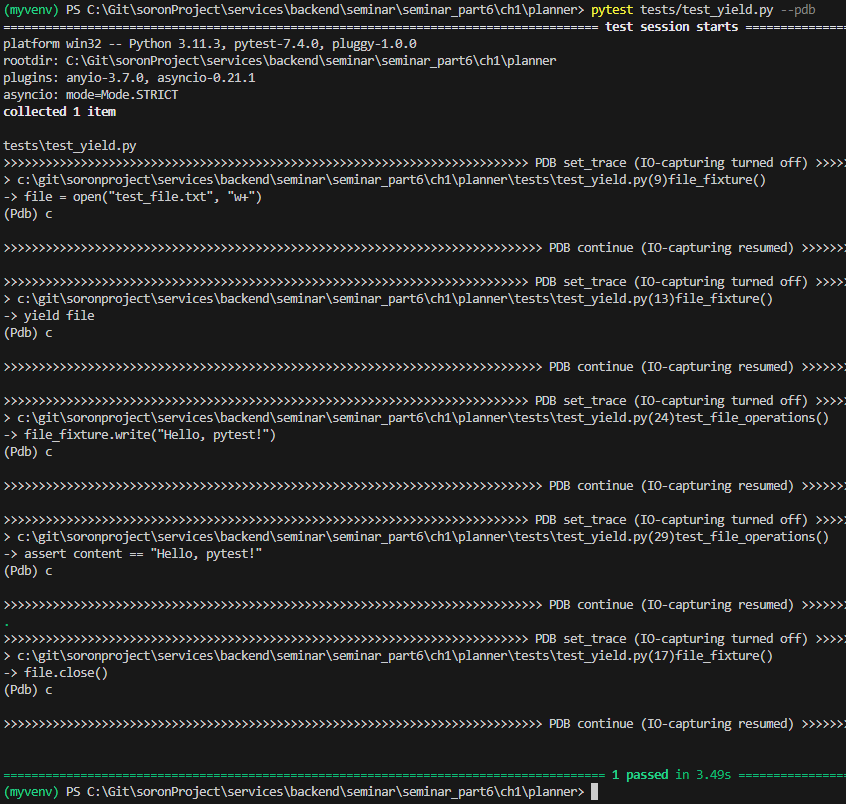

# 1. 테스트
- part6의 목표
  - pytest를 사용하여 애플리케이션 라우트 테스트를 작성하고 단위 테스트 하는 방법을 알 수 있다.
  

#### 1.1 pytest를 사용한 단위 테스트
- 단위테스트란?
  - 애플리케이션의 가장 작은 단위인 함수, 클래스 등 개별적인 부분을 테스트 하는 것
  - 예를 들어 개별 라우트가 적절한 응답을 반환하는지 테스트하기 위해 단위 테스트를 도입할 수 있다.
  - 프로그램의 작은 부분을 격리된 환경에서 테스트하므로 프로그램의 다른 부분에서 발생한 오류로 인한 영향을 받지 않는다.

<br/>

1. pytest를 사용하기 위해 pytest 라이브러리 설치
    > (venv)$ pip install pytest

1. 테스트 파일을 한곳에서 관리하기 위해 planner폴더 아래에 tests라는 폴더 생성

2. 테스트 파일 생성 시 파일명 앞에 'test_'를 붙여야만 해당 파일이 테스트 파일이라는 것을 pytest가 인식하여 실행한다. 사칙연산이 맞는지 확인하는 test_arithmetic_operations.py를 생성해보자.

```python
def add(a: int, b: int) -> int:
    return a + b


def subtract(a: int, b: int) -> int:
    return b - a


def multiply(a: int, b: int) -> int:
    return a * b


def divide(a: int, b: int) -> int:
    return b // a


def test_add() -> None:
    assert add(1, 1) == 11


def test_subtract() -> None:
    assert subtract(2, 5) == 3


def test_multiply() -> None:
    assert multiply(10, 10) == 100


def test_divide() -> None:
    assert divide(25, 100) == 4    
```

<br/>

###### 테스트 실행 결과


- assert 키워드는 식의 왼쪽에 있는 값이 오른쪽에 있는 결과와 일치하는지 검증할 떄 사용
- 테스트 실패 결과를 확인하기 위해 아래와 같이 수정 후 테스트
  
```python
def test_add() -> None:
    assert add(1,1) == 11
```

###### 테스트 실행 결과


<br/>

#### 1.1.2 픽스처를 사용한 반복 제거
- 픽스처는 테스트 함수가 실행되기 전 필요한 데이터나 상태,객체 등을 미리 설정하거나 구성하는데 사용된다.  

- @pytest.fixture 데코레이터로 지정한 함수는 픽스처 함수가 되고 이 함수를 테스트 할 함수의 파라미터로 전달하면 테스트 함수를 실행하기 전에 픽스처의 내용이 먼저 실행된다.  

- yield문을 사용하여 테스트 실행이 끝난 후 정리작업(clean-up)을 수행하는 데에도 활용된다.    

<br/>

###### 픽스처 사용 예시
```python
import pytest
import pdb;

@pytest.fixture
def file_fixture():
    """ 파일을 열고 파일 객체를 반환하는 픽스쳐 함수 """
    pdb.set_trace()
    # 파일을 여는 코드
    file = open("test_file.txt", "w+")
    pdb.set_trace()
    # 파일 객체를 반환
    yield file
    
    pdb.set_trace()
    # 정리(clean-up)작업: 파일을 닫음    
    file.close()
    

# 파일에 데이터를 쓰고, 읽어서 확인하는 테스트 함수 정의
def test_file_operations(file_fixture):
    pdb.set_trace()
    file_fixture.write("Hello, pytest!")
    file_fixture.seek(0)
    content = file_fixture.read()
    
    pdb.set_trace()
    assert content == "Hello, pytest!"
```

> 💡 pdb(Python Debugger)를 통한 디버깅  
>  pytest에서 디버깅 필요 시엔 pdb를 사용해 디버깅을 할 수 있다.  
>  위 예제에선 코드의 진행 흐름을 점프하는 fixture와 yield가 사용되었기에 예제의 실행흐름을 파악하기 위해 pdb를 사용하였다.

- pytest실행시 디버깅모드로 실행하는 명령어 
  - pytest --pdb
- pdb에서 자주 사용되는 명령어
  - n(ext): 다음 줄로 이동
  - c(ontinue): 다음 중단점으로 이동
  - s(tep): 함수 내부로 이동
  - q(uit): 디버거 모드를 끝내고 프로그램 종료

<br/>


 
- fixture 데코레이터는 인수를 선택적으로 받을 수 있다. scope인수는 픽스처 함수의 유효범위를 지정할 때 사용한다. 여기서는 두 가지 scope를 사용한다.

###### fixture의 scope에 사용되는 값
|     | 이름     | 설명                                                                                                                                                                                 |
| --- | -------- | ------------------------------------------------------------------------------------------------------------------------------------------------------------------------------------ |
|     | session  | 세션 내에서 픽스처 함수가 한번 실행되고, 해당 픽스처를 사용하는 모든 테스트함수에서 fixture객체를 공유한다. 여기서 세션이란 pytest를 실행하고 종료되기까지의 시간을 말한다.          |
|     | module   | 모듈내에서 픽스처 함수가 한번 실행되고, 해당 픽스처를 사용하는 같은 모듈에 있는 모든 테스트함수에서 fixture 객체를 공유한다. 여기서 모듈이란 테스트를 진행하는 파이썬 파일을 말한다. |
|     | class    | 클래스내에서 픽스처 함수가 한번 실행되고, 해당 픽스처를 사용하는 같은 클래스에 있는 모든 테스트함수에서 fixture 객체를 공유한다.                                                     |
|     | function | scope를 지정해주지 않았을때의 기본값. 픽스처를 사용하는 테스트 함수마다 새로 호출되며 객체를 공유하지 않는다.                                                                        |