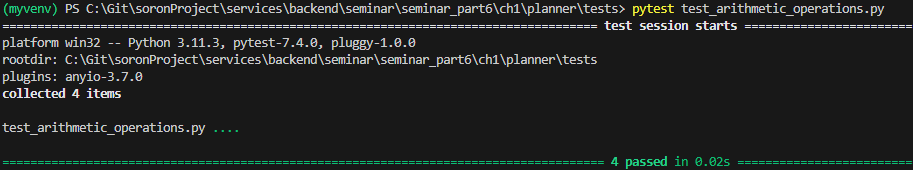
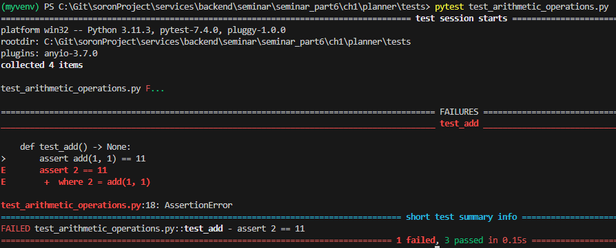

# 1. 테스트
- part6의 목표
  - pytest를 사용하여 애플리케이션 라우트 테스트를 작성하고 단위 테스트 하는 방법을 알 수 있다.
  

#### 1.1 pytest를 사용한 단위 테스트
- 단위테스트란?
  - 애플리케이션의 가장 작은 단위인 함수, 클래스 등 개별적인 부분을 테스트 하는 것
  - 예를 들어 개별 라우트가 적절한 응답을 반환하는지 테스트하기 위해 단위 테스트를 도입할 수 있다.
  - 프로그램의 작은 부분을 격리된 환경에서 테스트하므로 프로그램의 다른 부분에서 발생한 오류로 인한 영향을 받지 않는다.

<br/>

1. pytest를 사용하기 위해 pytest 라이브러리 설치
    > (venv)$ pip install pytest

1. 테스트 파일을 한곳에서 관리하기 위해 planner폴더 아래에 tests라는 폴더 생성

2. 테스트 파일 생성 시 파일명 앞에 'test_'를 붙여야만 해당 파일이 테스트 파일이라는 것을 pytest가 인식하여 실행한다. 사칙연산이 맞는지 확인하는 test_arithmetic_operations.py를 생성해보자.

```python
def add(a: int, b: int) -> int:
    return a + b


def subtract(a: int, b: int) -> int:
    return b - a


def multiply(a: int, b: int) -> int:
    return a * b


def divide(a: int, b: int) -> int:
    return b // a


def test_add() -> None:
    assert add(1, 1) == 11


def test_subtract() -> None:
    assert subtract(2, 5) == 3


def test_multiply() -> None:
    assert multiply(10, 10) == 100


def test_divide() -> None:
    assert divide(25, 100) == 4    
```

<br/>

###### 테스트 실행 결과


- assert 키워드는 식의 왼쪽에 있는 값이 오른쪽에 있는 결과와 일치하는지 검증할 떄 사용
- 테스트 실패 결과를 확인하기 위해 아래와 같이 수정 후 테스트
  
```python
def test_add() -> None:
    assert add(1,1) == 11
```

###### 테스트 실행 결과


#### 1.1.2 픽스처를 사용한 반복 제거
- 픽스처는 재사용할 수 있는 함수로, 테스트 함수에 필요한 데이터를 반환하기 위해 정의된다.
- @pytest.fixture 데코레이터를 사용해 정의하며 API 라우트 테스트 시 애플리케이션 인스턴스를 반환하는 경우 등에 사용


###### 픽스처 사용 예시
```python
import pytest
from ..models.events import EventUpdate


# 픽스처 정의
@pytest.fixture
def event() -> EventUpdate:
    return EventUpdate(
        title="이벤트 업데이트 타이틀",
        image="https://업데이트이미지/fastapi.png",
        description="이벤트 설명 업데이트",
        tags=["테스트 1", "테스트 2", "테스트 3"],
        location="로케이션 업데이트",
    )


def test_event_name(event: EventUpdate) -> None:
    assert event.title == "이벤트 업데이트 타이틀"
```

- 이 코드는 EventUpdate 모델의 인스턴스를 반환하는 픽스처를 정의한다.
- fixture 데코레이터는 인수를 선택적으로 받을 수 있다. scope인수는 픽스처 함수의 유효범위를 지정할 때 사용한다. 여기서는 두 가지 scope를 사용한다.
  - session: 테스트 전체 세션 동안 해당 함수가 유효하다.
  - module: 테스트 파일이 실행된 후 특정 함수에서만 유효하다.