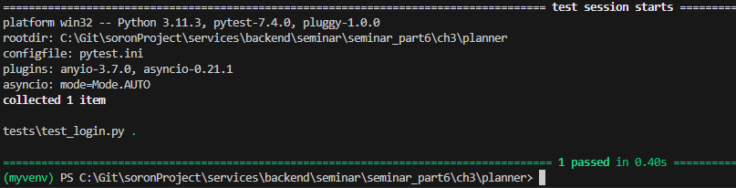
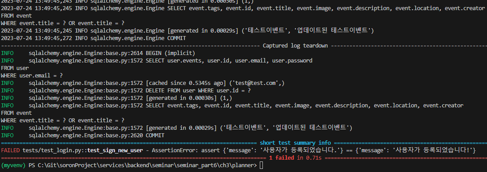
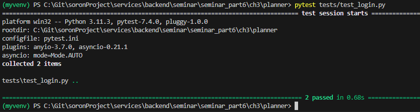
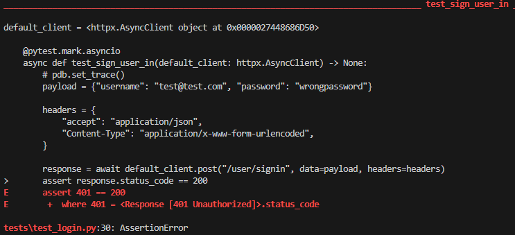
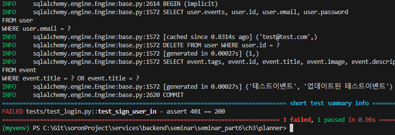
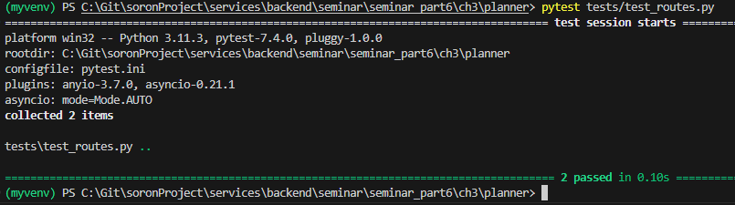
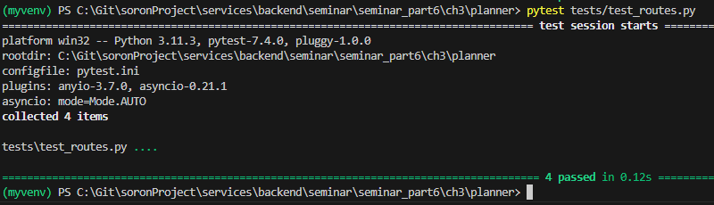
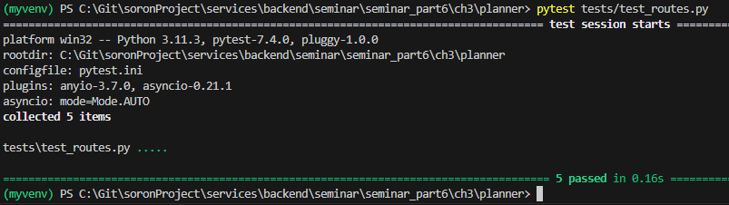
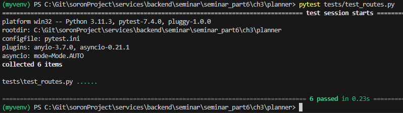

# 3. REST API 라우트 테스트 작성

#### 3.1 User 테스트 파일 생성
 
###### test_login.py
```python
import httpx
import pytest
```

<br/>

#### 3.2 사용자등록 라우트
- @pytest.mark.asyncio 데코레이터로 비동기 테스트라는 것을 명시

##### 3.2.1 사용자등록 라우트 테스트 작성

###### test_login.py
```python
@pytest.mark.asyncio
async def test_sign_new_user(default_client: httpx.AsyncClient) -> None: 
    payload = {"email": "test@test.com", "password": "testpassword"}

    headers = {"accept": "application/json", "Content-type": "application/json"}

    test_response = {"message": "사용자가 등록되었습니다."}

    response = await default_client.post("/user/signup", json=payload, headers=headers)    
    assert response.status_code == 200
    assert response.json() == test_response
```

<br/>

##### 3.2.2 사용자등록 라우트 테스트 실행
> (venv)$ pytest tests/test_login.py
- response의 내용을 변경 후 실패 테스트

<br/>

| 종류                                      | 결과                                  |
| ----------------------------------------- | ------------------------------------- |
| 성공 &nbsp;&nbsp;&nbsp;&nbsp;&nbsp;&nbsp; |   |
| 실패                                      |  |

<br/>

#### 3.3 로그인 라우트

##### 3.3.1 로그인 라우트 테스트 작성

###### test_login.py
```python
@pytest.mark.asyncio
async def test_sign_user_in(default_client: httpx.AsyncClient) -> None:
    payload = {"username": "test@test.com", "password": "testpassword"}

    headers = {
        "accept": "application/json",
        "Content-Type": "application/x-www-form-urlencoded",
    }

    response = await default_client.post("/user/signin", data=payload, headers=headers)
    assert response.status_code == 200
    assert response.json()["token_type"] == "Bearer"
```

<br/>

##### 3.3.2 로그인 라우트 테스트 실행
>(venv)$ pytest tests/test_login.py
- payload중 password 클레임의 값을 변경하여 실패 테스트
 
<br/>

| 종류                                      | 결과                                                                        |
| ----------------------------------------- | --------------------------------------------------------------------------- |
| 성공 &nbsp;&nbsp;&nbsp;&nbsp;&nbsp;&nbsp; |                                        |
| 실패                                      |   |

<br/>

#### 3.4 이벤트 테스트 파일 생성

###### test_routes.py
```python
import httpx
import pytest

import sys
from pathlib import Path
from planner.auth.jwt_handler import create_access_token
from planner.models.events import Event

@pytest.fixture(scope="module")
async def access_token() -> str:
    """
    테스트 파일 실행 시 한번만 실행될 픽스처
    테스트에 사용 할 계정의 액세스 토큰 생성 및 반환
    """
    return create_access_token("test@test.com")


@pytest.fixture(scope="module")
async def mock_event() -> Event:
    """
    테스트 파일 실행 시 한번만 실행될 픽스처
    테스트에 사용 할 이벤트 생성
    """
    # pdb.set_trace()   
    new_event = Event(
        creator="test@test.com",
        title="테스트이벤트",
        image="테스트이미지경로",
        description="테스트 설명",
        tags=["테스트 태그1", "테스트 태그2", "테스트 태그3"],
        location="테스트 로케이션",
    )
    
    session = get_session()

    for session in session:
        # 이벤트 생성
        session.add(new_event)
        session.commit()
        session.refresh(new_event)
        yield new_event
```

<br/>

#### 3.5 이벤트 조회 라우트

##### 3.5.1 이벤트 조회 라우트 테스트 작성

###### test_routes.py
```python
@pytest.mark.asyncio
async def test_get_events(default_client: httpx.AsyncClient, mock_event: Event) -> None:
    """
    모든 이벤트 조회 테스트
    GET /event
    """
    response = await default_client.get("/event")
    assert response.status_code == 200
    assert response.json()[0]["id"] == mock_event.id


@pytest.mark.asyncio
async def test_get_event(default_client: httpx.AsyncClient, mock_event: Event) -> None:
    """
    단일 이벤트 조회 테스트
    GET /event/{id}
    """
    url = f"/event/{str(mock_event.id)}"
    response = await default_client.get(url)
    assert response.status_code == 200
    assert response.json()["creator"] == mock_event.creator
    assert response.json()["id"] == mock_event.id
```

##### 3.5.2 이벤트 조회 라우트 테스트 실행
> (venv)$ pytest tests/test_routes.py

<br/>

| 종류                                                               | 결과                                  |
| ------------------------------------------------------------------ | ------------------------------------- |
| 전체이벤트 및 단일이벤트 조회 &nbsp;&nbsp;&nbsp;&nbsp;&nbsp;&nbsp; |  |

<br/>

#### 3.6 이벤트 생성 라우트

##### 3.6.1 이벤트 생성 라우트 테스트 작성

###### test_routes.py
```python
@pytest.mark.asyncio
async def test_post_event(default_client: httpx.AsyncClient, access_token: str) -> None:
    """
    이벤트 생성 테스트
    POST /event/new
    """
    payload = {
        "title": "테스트이벤트",
        "image": "테스트이미지경로",
        "description": "테스트 설명",
        "tags": ["테스트 태그1", "테스트 태그2", "테스트 태그3"],
        "location": "테스트 로케이션",
    }

    headers = {
        "content-type": "application/json",
        "Authorization": f"Bearer {access_token}",
    }

    test_response = {"메시지": "이벤트가 생성되었습니다."}

    response = await default_client.post("/event/new", json=payload, headers=headers)
    assert response.status_code == 200
    assert response.json() == test_response
```

<br/>

##### 3.6.2 이벤트 생성 라우트 테스트 실행
> (venv)$ pytest tests/test_routes.py

<br/>

| 종류                                             | 결과                                  |
| ------------------------------------------------ | ------------------------------------- |
| 이벤트 생성 &nbsp;&nbsp;&nbsp;&nbsp;&nbsp;&nbsp; |  |

<br/>

#### 3.7 이벤트 개수 확인 테스트

##### 3.7.1 이벤트 개수 확인 테스트 작성

###### test_routes.py
```python
@pytest.mark.asyncio
async def test_get_events_count(default_client: httpx.AsyncClient) -> None:
    """
    저장된 이벤트 개수 확인용 테스트

    mock_event 픽스처에서 이벤트 1개 생성
    test_post_event()에서 이벤트 1개 생성
    : 총 2개의 이벤트 생성
    """
    response = await default_client.get("/event")
    events = response.json()

    assert response.status_code == 200
    assert len(events) == 2
```

<br/>

##### 3.7.2 이벤트 개수 확인 테스트 실행
> (venv)$ pytest tests/test_routes.py

<br/>

| 종류                                            | 결과                                  |
| ----------------------------------------------- | ------------------------------------- |
| 이벤트 개수 확인 &nbsp;&nbsp;&nbsp;&nbsp;&nbsp; |  |

<br/>

#### 3.8 이벤트 변경 라우트

##### 3.8.1 이벤트 변경 라우트 테스트 작성

###### test_routes.py
```python
@pytest.mark.asyncio
async def test_update_event(
    default_client: httpx.AsyncClient, mock_event: Event, access_token: str
) -> None:
    """
    이벤트 변경 테스트
    """
    test_payload = {"title": "업데이트된 테스트이벤트"}

    headers = {
        "Content-Type": "application/json",
        "Authorization": f"Bearer {access_token}",
    }

    url = f"/event/{mock_event.id}"
    response = await default_client.put(url, json=test_payload, headers=headers)
    assert response.status_code == 200
    assert response.json()["title"] == test_payload["title"]
```

<br/>

##### 3.8.2 이벤트 변경 라우트 테스트 실행
> (venv)$ pytest tests/test_routes.py

<br/>

| 종류                                             | 결과                                  |
| ------------------------------------------------ | ------------------------------------- |
| 이벤트 변경 &nbsp;&nbsp;&nbsp;&nbsp;&nbsp;&nbsp; |  |

<br/>


#### 3.9 이벤트 삭제 라우트

##### 3.8.1 이벤트 삭제 라우트 테스트 작성

###### test_routes.py
```python
@pytest.mark.asyncio
async def test_delete_event(
    default_client: httpx.AsyncClient, mock_event: Event, access_token: str
) -> None:
    """
    이벤트 삭제 테스트
    """
    test_response = {"메시지": "이벤트가 정상적으로 삭제되었습니다."}

    headers = {
        "Content-Type": "application/json",
        "Authorization": f"Bearer {access_token}",
    }

    url = f"/event/{mock_event.id}"

    response = await default_client.delete(url, headers=headers)
    assert response.status_code == 200
    assert response.json() == test_response
```

<br/>

##### 3.9.2 이벤트 삭제 라우트 테스트 실행
> (venv)$ pytest tests/test_routes.py

<br/>

| 종류                                             | 결과                                  |
| ------------------------------------------------ | ------------------------------------- |
| 이벤트 삭제 &nbsp;&nbsp;&nbsp;&nbsp;&nbsp;&nbsp; |  |

<br/>

#### 3.10 이벤트 삭제 확인

##### 3.10.1 이벤트 삭제 확인 테스트 작성

###### test_routes.py
```python
@pytest.mark.asyncio
async def test_get_event_again(
    default_client: httpx.AsyncClient, mock_event: Event
) -> None:
    """이벤트 정상적으로 삭제되었는지 테스트
    이 테스트가 정상적으로 동작했다면 발생해야 하는 코드는 404 이다.
    데이터가 삭제되어 없어야 하기 때문
    """
    pdb.set_trace()   
    url = f"/event/{mock_event.id}"
    response = await default_client.get(url)

    assert response.status_code == 404
    if response.status_code != 404:
        assert response.json()["creator"] == mock_event.creator
        assert response.json()["id"] == mock_event.id
```
<br/>

##### 3.10.2 이벤트 삭제 확인 테스트 실행
> (venv)$ pytest tests/test_routes.py

<br/>

| 종류                                                  | 결과                                   |
| ----------------------------------------------------- | -------------------------------------- |
| 이벤트 삭제 확인 &nbsp;&nbsp;&nbsp;&nbsp;&nbsp;&nbsp; |  |

<br/>