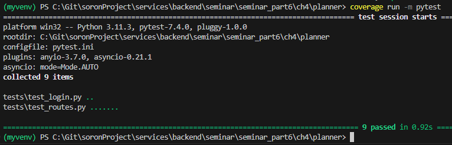
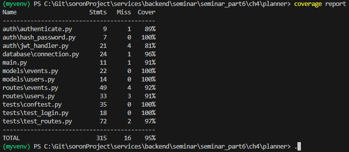
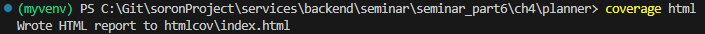
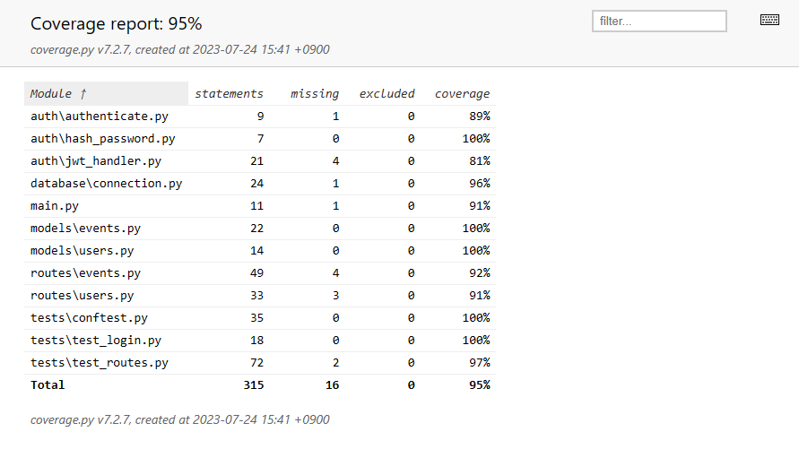
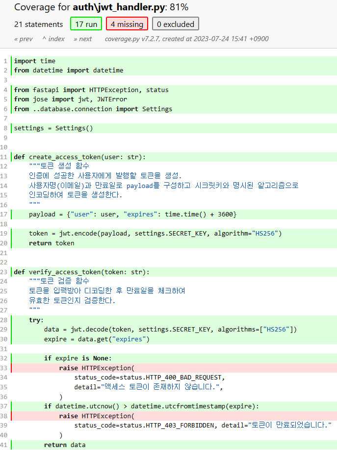

# 4. 테스트 커버리지

#### 4.1 테스트 커버리지 설치
> (venv)$ pip install coverage

 

#### 4.2 테스트 커버리지 보고서 생성
> (venv)$ coverage run -m pytest

 

###### 테스트 커버리지 보고서 생성화면

 

#### 4.3 테스트 커버리지 보고서 확인
> (venv)$ coverage report

 

###### 테스트 커버리지 보고서 확인화면

- 이 보고서는 테스트를 통해 실행된(테스트에 사용된) 코드의 비율을 보여준다.

 

#### 4.4 테스트 커버리지 보고서 html로 생성
- (venv)$ coverage html

 

###### 테스트 커버리지 보고서(html) 생성

 

#### 4.5 테스트 커버리지 보고서(html) 확인

 

#### 4.6 보고서에서 모듈 클릭 시 상세화면
