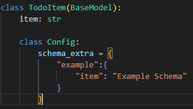
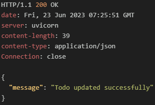
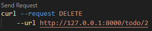
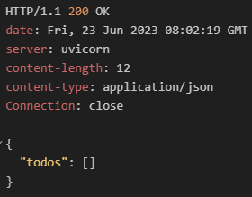

# 5. 간단한 CRUD 애플리케이션 개발
#### 5.1 UPDATE
 

##### 5.1.1 UPDATE 라우트의 요청 바디용 스키마 추가
##### schemas.py

 
 

##### 5.1.2 UPDATE 라우트 경로 및 UPDATE 기능 작성
##### todo.py

 
 

##### 5.1.3 PUT 전송 및 결과확인
|  |  |  |
| ------------------------------- | ------------------------------- | ------------------------------- |

 
 

#### 5.2 DELETE
 

##### 5.2.1 DELETE 라우트 경로 및 DELETE 기능 작성 
##### todo.py

 

##### 5.2.2 DELETE 전송 및 결과 확인

##### 처음DB값
|  |  |
| -------------------------------- | ------------------------------- |

##### 한개 DELETE
|  |  |
| ------------------------------- | ------------------------------- |

##### 전부 DELETE
|  |  |
| -------------------------------- | -------------------------------- |